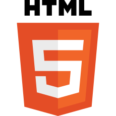

# HTML

**HTML** es el lenguaje de marcado estándar para la creación de páginas web

- HTML significa lenguaje de marcado de hypertexto.
- HTML describe la estructura de una página web.
- HTML consiste en una serie de elementos.
- Los elementos de HTML le dicen al navegador como mostrar el contenido.
- Los elementos de HTML están representados por etiquetas.
- Las etiquetas de HTML etiquetan piezas de contenido como el encabezado, un párrafo, una tabla...
- Los navegadores no muestran las etiquetas de HTML pero las usan para renderizar el contenido de la página.

## Como se ve un documento de HTML

```html
<!DOCTYPE html>
<html>
  <head>
    <title>Título de la página</title>
  </head>
  <body>
    <h1>Mi primer título</h1>
    <p>Mi primer párrafo</p>
  </body>
</html>
```

Explicación del documento

- La declaración `<!DOCTYPE html>` define que este documento es HTML5.
- El elemento `<html>` es el elemento raíz de una página HTML.
- El elemento `<head>` contiene meta información del documento que no se muestra directamente en el navegador.
- El elemento `<title>` especifíca un título para el documento.
- El elemento `<body>` contiene todo el contenido visible de la página.
- El elemento `<h1>` define un título principal.
- El elemento `<p>` define un párrafo.

## Ícono



## Bibliografía

- Fragmento de [w3schools](https://www.w3schools.com/html/html_intro.asp)

## Transcripción por

Escrito con fines académicos  
Edwin García
